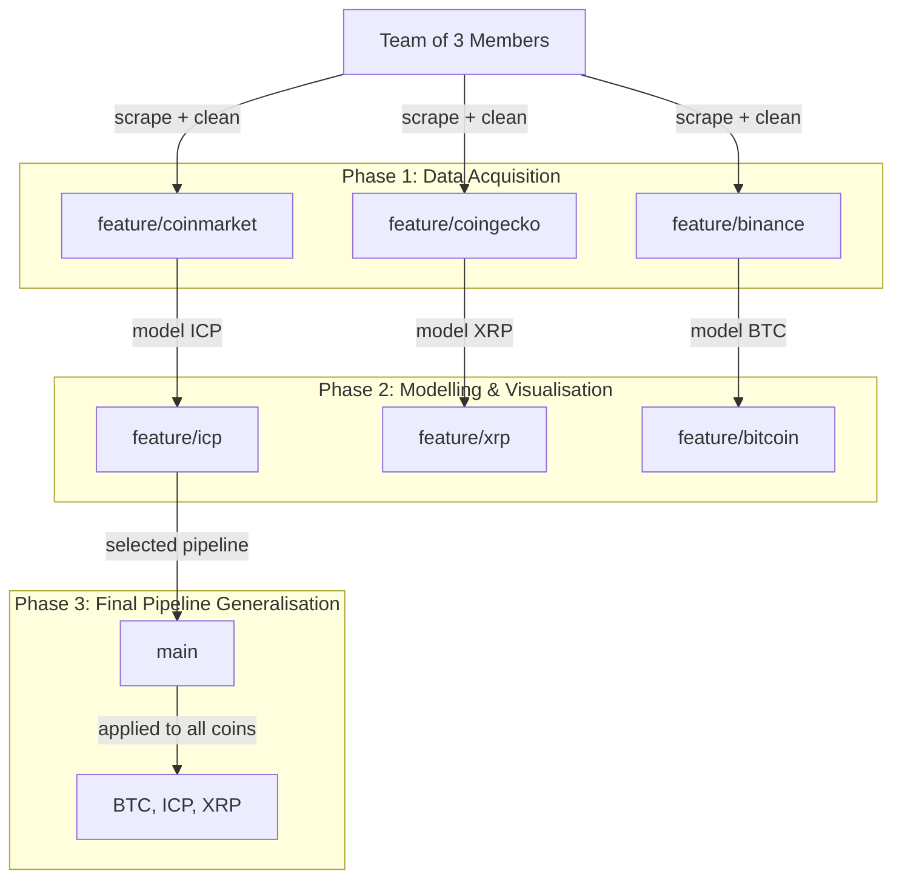

# Cryptocurrency Price Direction Prediction
### CIP02 – Data Collection, Integration and Preprocessing (HSLU) · Group 103 · FS 2026

## Abstract

This project builds a binary classification pipeline to predict the daily price movement direction (up or down) of three major cryptocurrencies — Bitcoin (BTC), XRP, and Internet Computer (ICP) — using publicly available market indicators from the preceding day.
Historical OHLCV data spanning three years was collected from CoinMarketCap using a Playwright-based scraper, cleaned, and enriched with log-transformed technical features.
An exploratory data analysis confirmed near-random return dynamics and identified a five-feature stationary predictor set.
Two classifiers were evaluated under a strict chronological 70/15/15 train/validation/test split: Logistic Regression and Decision Tree.
Test-set accuracy ranged from 40 to 63 %, consistent with the efficient market hypothesis and near-random walk behaviour identified in the EDA.


## Research Questions

1. Which market indicators have the strongest relationship with daily cryptocurrency price changes?
2. How accurately can historical indicators from day (t-1) predict price direction on day (t)?
3. Which machine learning model achieves the highest classification accuracy?


## Data Source and Collection

Data was collected exclusively from **CoinMarketCap** using a Playwright-based scraper (`src/coinmarket_scrape.py`). Playwright drives a headless Chromium browser to handle JavaScript-rendered price tables.

- **Coverage:** 2022-12-08 to 2026-03-19 — **1,198 rows per coin**
- **Coins:** Bitcoin (BTC), XRP, Internet Computer (ICP)
- **Fields:** Date, Open, High, Low, Close, 24-hour Volume, Market Capitalisation (OHLCV)


## Data Processing

- Missing value checks, duplicate date detection, OHLCV constraint verification (all passed)
- No outliers removed — extreme price events (exchange listings, market crashes) are real market signals
- **Logarithmic scaling** applied throughout: log prices are normally distributed, log returns are symmetric and additive, and log-transforming volume/market cap removes scale dominance across assets
- **Stationarity analysis**: non-stationary level features (`log_close`, `ma_7`, `ma_30`, `log_market_cap`) excluded due to pairwise Pearson correlations ≥ 0.91 — would produce spurious correlations with the target
- **Data leakage prevention:** all features lagged by one day before training


## Feature Engineering

Five stationary features used for modelling (all values from day t-1):

| Feature | Description |
|---|---|
| `log_return` | log(p_t / p_{t-1}) — daily log return |
| `log_close_open_ratio` | log(close / open) — intraday direction |
| `log_high_low_ratio` | log(high / low) — intraday range |
| `volatility_7` | 7-day rolling standard deviation of log returns |
| `log_volume_change` | log(v_t / v_{t-1}) — relative volume change |

Binary target `price_direction` = 1 if log(p_t / p_{t-1}) > 0, else 0.


## Analysis

**Exploratory Data Analysis:**
- Autocorrelation (ACF) for lags 1–20 — confirmed near-random walk behaviour; nearly all ACF coefficients fall within the 95 % confidence band (±0.057)
- Lag-1 Pearson correlations between each feature and the target
- Cross-asset log return correlations: BTC-XRP r = 0.589, BTC-ICP r = 0.572, XRP-ICP r = 0.491
- Rolling 30-day volatility: ICP highest (mean σ₇ = 4.41 %), XRP (3.41 %), BTC (2.23 %)

**Key EDA finding:** The ACF-derived accuracy ceiling is ~58 %. A majority-class baseline achieves 50.4 % (BTC), 51.1 % (XRP), 52.6 % (ICP).

**Modelling:**
- Strict chronological 70/15/15 train/validation/test split per coin (no shuffling)
- Models: Logistic Regression and Decision Tree (deliberately low complexity to match the weak signal structure)
- Metrics: Accuracy (primary), Precision, Recall, F1-score

**Test-set results:**

| Coin | Model | Acc. | Prec. | Rec. | F1 |
|---|---|---|---|---|---|
| Bitcoin | Logistic Regression | 0.453 | 0.455 | 0.698 | 0.551 |
| Bitcoin | Decision Tree | 0.447 | 0.427 | 0.442 | 0.434 |
| ICP | Logistic Regression | 0.626 | 0.625 | 0.141 | 0.230 |
| ICP | Decision Tree | 0.503 | 0.390 | 0.451 | 0.418 |
| XRP | Logistic Regression | 0.397 | 0.372 | 0.786 | 0.505 |
| XRP | Decision Tree | 0.436 | 0.358 | 0.557 | 0.436 |

Random baseline = 0.50 · ACF-derived ceiling = 0.58


## Key Findings

- Publicly available daily market indicators have **very limited predictive power** for next-day price direction
- The strongest significant predictor for BTC and XRP is `log_return` (r ≈ −0.07 to −0.08), indicating a weak mean-reversion tendency; for ICP it is `volatility_7` (r = −0.062)
- All r² values remain below 0.7 %, confirming the relationships are statistically detectable but practically negligible
- Neither model consistently outperforms the other; Logistic Regression is marginally more stable
- ICP's 62.6 % Logistic Regression accuracy is misleading — recall of only 14.1 % reveals the model almost exclusively predicts the majority class


## Limitations

- Feature set limited to price-derived technical indicators; sentiment, on-chain metrics, and macroeconomic variables are excluded
- Only two classifiers evaluated; ensemble methods (e.g. Random Forest) may offer marginal improvements
- Decision Tree is not hyperparameter-tuned; pruning could reduce the validation/test performance gap


## Project Structure

```
CIP_FS2026_103/
├── data/          # raw and processed datasets
├── docs/          # reports, feasibility study, documentation
├── images/        # EDA and model result plots
├── latex/         # LaTeX report source
├── src/           # core logic (scraper, features, models)
└── .venv/         # virtual environment (not tracked)
```


## Technologies

- Python 3.10+
- Playwright (headless Chromium scraping)
- Pandas 3.0.1, NumPy 2.4.3
- scikit-learn 1.8.0
- Matplotlib 3.10.8, Seaborn 0.13.2


## Collaboration & Repository Workflow

### Parallel Development

The project followed a parallel workflow in which each team member independently built a complete pipeline. Each member collected data for three cryptocurrencies using their own scraping approach, then selected one coin to perform data preprocessing, feature engineering, modelling, and visualization.

This approach enabled multiple implementations and modelling strategies to be developed simultaneously while ensuring that all core project components were covered individually

### Final Integration

The main branch contains a single finalized end-to-end pipeline. This implementation was selected from the individual contributions because it was the most complete, clean, and well-structured at the time of consolidation.

Other implementations and intermediate work remain available in their respective branches.

### Workflow Diagram


## Authors

Lemma Emanuel · Spagolla Raphaël · Krishnathasan Tharrmeehan
Hochschule Luzern (HSLU) — MSc Applied Information and Data Science
