# Exploratory Data Analysis Report
## Cryptocurrency Price Prediction: CIP FS2026 Group 103

**Authors:** Krishnathasan Tharrmeehan, Lemma Emanuel, Spagolla Raphaël
**Date:** 2026-03-22
**Course:** Data Collection, Integration and Preprocessing (FS 2026)

---

## Table of Contents

1. [Introduction](#1-introduction)
2. [Data Overview & Quality](#2-data-overview--quality)
3. [Univariate Analysis](#3-univariate-analysis)
4. [Bivariate & Correlation Analysis](#4-bivariate--correlation-analysis)
5. [Time Series Analysis](#5-time-series-analysis)
6. [Cross-Asset Analysis](#6-cross-asset-analysis)
7. [Key Findings Summary](#7-key-findings-summary)
8. [Transition to ML Modelling](#8-transition-to-ml-modelling)

---

## 1. Introduction

### 1.1 Purpose of This EDA

This Exploratory Data Analysis (EDA) is a systematic examination of a dataset to understand its structure, patterns, and relationships before any formal modelling. It serves as the empirical foundation for a machine learning study on cryptocurrency price prediction. Rather than diving directly into model building, the EDA first ensures that data quality is sufficient, that the right features are selected, and that modelling assumptions are justified by the data itself.

The analysis is structured around three research questions:

1. **RQ1: Indicator relevance.** Which market indicators have the strongest relationship with cryptocurrency price changes?
2. **RQ2: Short-term predictability.** How accurately can historical market indicators from day (t−1) predict the direction of price movement (up or down) at day (t)?
3. **RQ3: Model selection.** Which machine learning model achieves the highest accuracy in predicting price direction at day (t)?

This report addresses RQ1 and RQ2 directly through the EDA findings, and derives the feature set and model recommendations for RQ3 in Section 8.

### 1.2 Assets Analysed

Three cryptocurrencies were selected for this study. A cryptocurrency is a digital form of money that exists only online and is not controlled by any central bank or government. Its price is determined entirely by supply and demand on global trading platforms.

**Bitcoin (BTC)** is the first and largest cryptocurrency by market value. Created in 2009, it is often considered the reference asset for the entire crypto market. When Bitcoin's price falls sharply, most other cryptocurrencies tend to fall as well. Over the study period, Bitcoin's closing price ranged from $16,440 to $124,753.

**XRP** is a cryptocurrency developed by the company Ripple, designed primarily for fast international money transfers between banks. It is considerably smaller than Bitcoin and significantly more volatile. Over the study period, XRP's closing price ranged from $0.34 to $3.56.

**Internet Computer (ICP)** is a cryptocurrency associated with a decentralised computing platform developed by the DFINITY Foundation. It is the smallest and most volatile of the three assets in this study. Over the study period, ICP's closing price ranged from $2.09 to $19.05.

### 1.3 Time Period and Data Source

All data covers the period from **8 December 2022 to 19 March 2026**, totalling **1,198 calendar days** per asset. Data was collected from [CoinMarketCap](https://coinmarketcap.com), a publicly accessible financial data platform, using an automated web scraper built with the Playwright browser automation library. Each dataset contains daily price and trading data (see Section 2).

### 1.4 Analytical Methods Applied

The EDA applies the following methods, each chosen for a specific reason:

| Method | Why applied |
|---|---|
| Logarithmic transformation | Crypto prices follow log-normal distributions; log returns are symmetric and easier to analyse statistically |
| Descriptive statistics (mean, std, skewness, kurtosis) | Characterise the distribution of each variable |
| OHLCV integrity checks | Verify that raw data is internally consistent (e.g. daily high ≥ daily low) |
| Pearson / point-biserial correlation | Measure linear relationships between indicators and next-day price direction |
| Stationarity analysis | Identify which features are safe to use in lag-based predictive analysis |
| Autocorrelation Function (ACF) | Quantify whether past returns contain predictive information |
| Rolling volatility | Identify market regimes and volatility clustering patterns |
| Cross-asset correlation | Measure co-movement between Bitcoin, XRP, and ICP |

---

## 2. Data Overview & Quality

### 2.1 Dataset Structure

Each of the three datasets has an identical structure. The raw data contains **7 columns** and **1,198 rows** (one row per calendar day):

| Column | Data Type | Description |
|---|---|---|
| `date` | datetime | Calendar date (daily granularity) |
| `open` | float | Opening price in USD at the start of the day |
| `high` | float | Highest price reached during the day |
| `low` | float | Lowest price reached during the day |
| `close` | float | Closing price in USD at the end of the day |
| `volume` | float | Total trading volume (the total USD value of cryptocurrency bought and sold that day) |
| `market_cap` | float | Market capitalisation (total value of all coins in circulation, in USD) |

This data format is known as **OHLCV data** (Open, High, Low, Close, Volume), which is the standard format used in financial market analysis.

**Sample rows (first entry per coin):**

| Asset | Date | Open | High | Low | Close | Volume (USD) | Market Cap (USD) |
|---|---|---|---|---|---|---|---|
| Bitcoin | 2022-12-08 | 17,093 | 17,259 | 16,930 | 16,973 | 18.7B | 326.7B |
| XRP | 2022-12-08 | 0.375 | 0.383 | 0.366 | 0.369 | 857M | 19.0B |
| ICP | 2022-12-08 | 3.720 | 3.773 | 3.555 | 3.567 | 22.0M | 1.54B |

### 2.2 Missing Values

**Raw OHLCV columns:** No missing values were found in any of the seven raw columns across all three datasets (0 missing values, 1,198 complete rows per coin).

**Engineered rolling-window features:** Three derived features produce a small, expected number of missing values at the start of the time series, because they require a minimum number of prior days to compute:

| Feature | Window | Missing Rows | Reason |
|---|---|---|---|
| `ma_7` (7-day moving average) | 7 days | 6 | First 6 rows have fewer than 7 prior days |
| `volatility_7` (7-day rolling std) | 7 days | 7 | First 7 rows have insufficient history |
| `ma_30` (30-day moving average) | 30 days | 29 | First 29 rows have fewer than 30 prior days |

**Handling decision:** These missing rows are **retained in the time-series plots** (to preserve the full date range visually) but are **dropped automatically** before any statistical analysis or correlation computation. This is the standard and methodologically correct approach for rolling-window features. The missing values are a mathematical necessity of the window calculation and not a data quality problem.

### 2.3 Duplicate Rows

No duplicate rows were found in any dataset. Each date appears exactly once per coin.

### 2.4 OHLCV Logic Violations

Financial market data must satisfy several internal consistency conditions. For example, the daily high price must always be at least as large as the opening price, the closing price, and the daily low. The following checks were performed:

| Check | Bitcoin | XRP | ICP |
|---|---|---|---|
| `high < open` (impossible) | 0 violations | 0 violations | 0 violations |
| `high < close` (impossible) | 0 violations | 0 violations | 0 violations |
| `low > open` (impossible) | 0 violations | 0 violations | 0 violations |
| `low > close` (impossible) | 0 violations | 0 violations | 0 violations |
| `volume < 0` (impossible) | 0 violations | 0 violations | 0 violations |

All datasets pass every integrity check. The raw data is internally consistent and requires no correction.

### 2.5 Outliers and Treatment Decision

Rather than removing extreme values, this study uses **logarithmic transformation** of all key variables (see Section 2.6). Logarithmic scaling compresses extremely large values toward the centre of the distribution, thereby reducing the distorting effect of outliers without discarding any data. This is the methodologically preferred approach for financial time-series data, where extreme events (market crashes, sudden rallies) are rare but real and should not be excluded from the analysis.

No rows were deleted due to outliers.

### 2.6 Scale Differences and Justification for Log Transformation

The three assets operate on vastly different price scales:

| Asset | Min Close (USD) | Max Close (USD) | Mean Close (USD) |
|---|---|---|---|
| Bitcoin | 16,440 | 124,753 | 65,313 |
| XRP | 0.34 | 3.56 | 1.26 |
| ICP | 2.09 | 19.05 | 6.73 |

Plotting or comparing these directly on the same axis would make XRP and ICP invisible next to Bitcoin. Beyond the scale problem, **cryptocurrency prices follow a log-normal distribution**. This means that price changes are better described as proportional (e.g. "up 5%") rather than absolute (e.g. "up $5"). The logarithmic transformation (taking the natural logarithm of all prices and quantities) resolves both issues:

- It places all three assets on a comparable, dimensionless scale.
- It converts multiplicative price dynamics into additive ones, which are more suitable for statistical analysis.
- It produces the **log return** (the main variable of interest), which is symmetric around zero for gains and losses. The percentage return, by contrast, is mathematically bounded below at −100% but unbounded above.

All derived features used in this analysis are log-transformed (see Section 3 for the full feature list).

---

## 3. Univariate Analysis

### 3.1 Engineered Features

Before examining distributions, the following features were engineered from the raw OHLCV data:

| Feature | Formula | Interpretation |
|---|---|---|
| `log_return` | log(close_t / close_{t−1}) | **Daily log return.** Positive = price went up; negative = price went down. The main variable for measuring daily price changes. |
| `log_close_open_ratio` | log(close / open) | **Intraday momentum.** Measures how much the price moved from the opening to the closing of the same day. Positive = closed above open (bullish); negative = closed below open (bearish). |
| `log_high_low_ratio` | log(high / low) | **Intraday range.** Measures how wide the price swings were within a single day. Always positive. A larger value means a more turbulent day. |
| `ma_7` | rolling 7-day mean of log(close) | **Short-term trend.** Smooths out daily noise; rises when the short-term trend is upward. |
| `ma_30` | rolling 30-day mean of log(close) | **Long-term trend.** A slower-moving indicator of the dominant price direction over the past month. |
| `volatility_7` | rolling 7-day std of log_return | **Recent volatility.** Measures how much the daily returns have varied over the past week. Higher = more uncertain market conditions. |
| `log_volume_change` | log(volume_t / volume_{t−1}) | **Volume change.** Whether trading activity increased or decreased compared to the previous day. |
| `price_direction` | 1 if close > open, else 0 | **ML target variable.** Encodes whether the day was bullish (1) or bearish (0). This is what the machine learning models will predict. |

### 3.2 Daily Log Returns

The **log return** is the central variable of this study. It measures the relative daily price change on a logarithmic scale. A log return of +0.05 corresponds to approximately a +5.1% price increase; a log return of −0.05 corresponds to approximately a −4.9% price decrease. Values close to zero mean the price was nearly unchanged.

**Descriptive statistics:**

| Statistic | Bitcoin | XRP | ICP |
|---|---|---|---|
| Mean | 0.001170 | 0.001086 | −0.000452 |
| Median | −0.000007 | −0.000559 | −0.002484 |
| Std deviation | 0.024767 | 0.042424 | 0.050448 |
| Minimum | −0.1523 | −0.2189 | −0.3633 |
| Maximum | +0.1180 | +0.5486 | +0.3295 |
| Skewness | 0.2225 | 2.3713 | 0.5833 |
| Excess kurtosis | 3.4870 | 28.7439 | 6.5361 |

**Interpretation of key statistics:**

- **Mean and median near zero:** For all three coins, both mean and median log return are very close to zero, meaning that on any given day a price increase and a price decrease are roughly equally likely. This is consistent with an **efficient market**, a market where available information is already priced in, making future moves hard to predict.
- **Standard deviation as a volatility measure:** Bitcoin's standard deviation of 0.0248 means typical daily moves are about ±2.5%. XRP (±4.2%) and ICP (±5.0%) are considerably more volatile.
- **Skewness:** A value of 0 means the distribution is perfectly symmetric. Bitcoin's skewness (0.22) is near-symmetric. XRP's extremely high skewness (2.37) indicates a heavy right tail. There were a few exceptionally large upward moves, including a single day with log return = +0.5486, equivalent to a +73% gain in one day. ICP is moderately right-skewed (0.58).
- **Excess kurtosis:** A normal distribution has excess kurtosis = 0. All three coins show positive excess kurtosis, meaning their return distributions have **heavier tails** than normal. This means extreme events are more common than a normal distribution would predict. XRP's kurtosis of 28.74 is remarkably high, driven by extreme outlier events.

**Figure 1 (`hist_log_return.png`): Log Return Distribution Histograms**

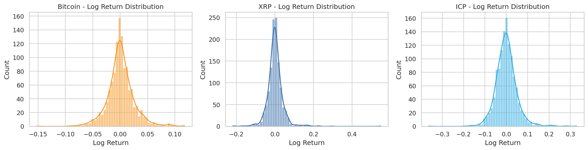

Figure 1 shows three side-by-side histograms, one for each cryptocurrency. Each histogram displays the frequency (vertical axis: count of days) of daily log returns (horizontal axis). A smooth curve (kernel density estimate) is overlaid to show the underlying shape.

On this plot we can see that all three distributions are roughly bell-shaped and centred close to zero. However, the width of the distribution differs clearly: Bitcoin's histogram is the narrowest, XRP's is wider, and ICP's is the widest, with the most extreme values on both sides. All three distributions show slightly heavier tails than a perfect bell curve, with a few exceptional days far from the centre.

This indicates that Bitcoin is the least volatile of the three assets, ICP is the most volatile, and all three exhibit the **leptokurtic** (heavy-tailed) behaviour typical of financial returns. This is a well-known statistical property of financial data and motivates the choice of log transformation over raw price differences.

**Figure 2 (`boxplot_log_return.png`): Log Return Boxplot Comparison**

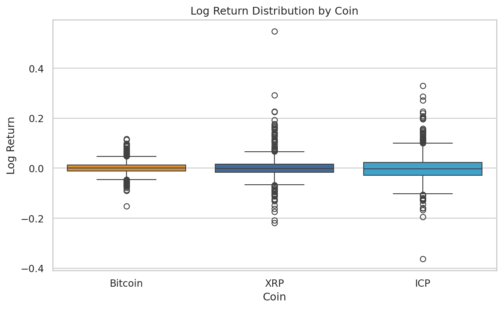

Figure 2 shows three side-by-side box plots, one per cryptocurrency, comparing the spread of daily log returns. A box plot (also called a box-and-whisker plot) displays the middle 50% of values as a box, with a line at the median. The whiskers extend to the furthest non-outlier observations, and individual dots beyond the whiskers represent outlier days.

On this plot we can see that Bitcoin's box is the smallest, indicating tight and predictable daily moves. XRP's box is slightly wider, and ICP's is the widest. All three coins have numerous outlier dots beyond the whiskers, confirming the heavy-tailed nature observed in Figure 1. XRP shows the most extreme positive outliers (dots far above the box), corresponding to its rare but massive single-day spikes.

This indicates that the three assets differ significantly in their daily volatility profile, with ICP carrying the highest risk of large daily moves in both directions.

### 3.3 Price Direction (Target Variable)

The binary target variable `price_direction` encodes whether a day was bullish (1 = close > open, price went up during the day) or bearish (0 = close ≤ open, price went down or was flat).

| Asset | Bullish Days (%) | Bearish Days (%) |
|---|---|---|
| Bitcoin | 50.4% | 49.6% |
| XRP | 49.1% | 50.9% |
| ICP | 47.4% | 52.6% |

The classes are **nearly balanced** across all three coins. There is no meaningful imbalance between up days and down days. This is an important property: if one class dominated (e.g. 90% bullish days), a model could achieve high accuracy simply by always predicting "up." With balanced classes, accuracy is a valid and meaningful evaluation metric.

### 3.4 Intraday Indicators

**`log_close_open_ratio` (intraday momentum):**

| Statistic | Bitcoin | XRP | ICP |
|---|---|---|---|
| Mean | 0.001191 | 0.001121 | −0.000487 |
| Std deviation | 0.024751 | 0.042441 | 0.050443 |

The mean is very close to zero for all coins, confirming that markets do not systematically close higher or lower than they open. The standard deviation mirrors that of log_return. This is expected because both features measure essentially the same intraday movement.

**`log_high_low_ratio` (intraday range):**

| Statistic | Bitcoin | XRP | ICP |
|---|---|---|---|
| Mean | 0.034847 | 0.052947 | 0.071500 |
| Std deviation | 0.022577 | 0.046636 | 0.051124 |

The mean is always positive, as expected, because the daily high is always above the daily low. A higher mean indicates wider intraday price swings. ICP has the widest average intraday range (7.1% per day), followed by XRP (5.3%) and Bitcoin (3.5%).

### 3.5 Volatility (7-Day Rolling Standard Deviation)

| Statistic | Bitcoin | XRP | ICP |
|---|---|---|---|
| Mean volatility_7 | 2.23% | 3.41% | 4.41% |
| Std of volatility_7 | 1.10% | 2.54% | 2.36% |

These values confirm the volatility ranking: Bitcoin < XRP < ICP. The high standard deviation of `volatility_7` for all three coins indicates that volatility is not constant over time. It rises and falls in clusters, a property analysed in detail in Section 5.3.

### 3.6 Price Level and Market Trends

**Figure 3 (`price_trend.png`): Cumulative Log Return Over Time**

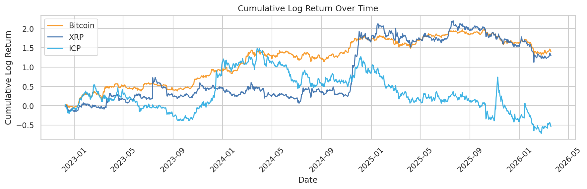

Figure 3 shows the cumulative log return (the running total of daily log returns) over the full 3.3-year study period. All three lines begin at 0.0 in December 2022 (so they can be compared on the same axis despite very different price levels). A value of +1.0 at any point means the asset has gained approximately 172% since the start; a value of −0.5 means it has lost approximately 39%.

On this plot we can see that Bitcoin and XRP both trend strongly upward over the period, with Bitcoin reaching a cumulative log return of approximately +1.40 (≈ +306% total gain) and XRP reaching approximately +1.30 (≈ +267% gain). ICP, by contrast, ends the period with a cumulative log return of approximately −0.54 (≈ −42% total loss), despite showing temporary rallies. All three assets experience a shared dip around early 2023 (the aftermath of the FTX exchange collapse in November 2022, one of the largest crypto bankruptcies in history), followed by recovery.

This indicates that the study period captures a meaningful range of market conditions, including a bear market in 2022–2023 and a bull market in 2024–2025. This variety is important for building a model that generalises across different market environments.

**Figure 4 (`volume_trend.png`): Log Trading Volume Over Time**

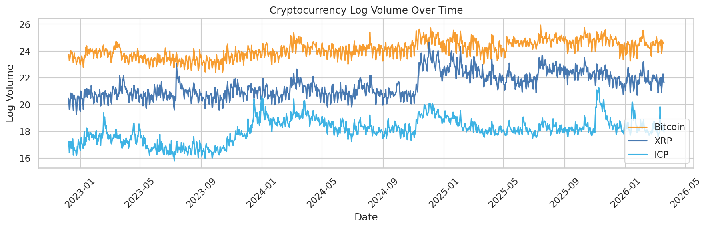

Figure 4 shows the log-transformed trading volume for all three coins over time, with each coin plotted on its own y-axis to account for scale differences (Bitcoin's daily trading volume is orders of magnitude larger than ICP's).

On this plot we can see that Bitcoin's volume fluctuates with visible spikes around major market events (e.g. the 2024 Bitcoin ETF approval, price all-time-highs). XRP shows a very sharp volume spike in late 2024, corresponding to a major price rally. ICP's volume is much smaller and shows more erratic patterns.

This indicates that trading activity is not constant over time. It accelerates during periods of excitement or panic, which is a well-known phenomenon in financial markets.

**Figure 5 (`market_cap_trend.png`): Log Market Capitalisation Over Time**

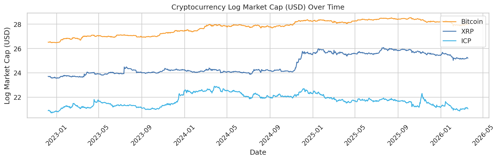

Figure 5 shows the log market capitalisation (total USD value of all coins in circulation) over time for all three assets.

On this plot we can see that all three follow a trend broadly consistent with their price trends. Market cap rises when price rises. Bitcoin's market cap dwarfs the other two assets. ICP's market cap shows a declining trend over much of the study period, consistent with its negative cumulative return.

This indicates that market cap is highly collinear with price (specifically with `log_close`) and therefore carries little additional predictive information beyond what the price itself provides. This observation is confirmed quantitatively in Section 4.

---

## 4. Bivariate & Correlation Analysis

### 4.1 Full Feature Correlation Heatmaps

The correlation heatmap displays the **Pearson correlation coefficient** (r) between every pair of features, including the target variable `price_direction`. Pearson correlation measures the strength and direction of a linear relationship between two variables, ranging from −1 (perfect inverse relationship) to +1 (perfect positive relationship). Values near 0 indicate no linear relationship.

**Important methodological note:** The heatmaps in Figures 6–8 show **same-day correlations**. They measure how features relate to `price_direction` on the same day, not the next day. Two features, `log_close_open_ratio` and `log_return`, show very high same-day correlation with `price_direction` (~0.70), but this is a **mathematical artifact** and not a predictive signal. `price_direction = 1` if and only if `close > open`, while `log_close_open_ratio = log(close/open)`, which is positive if and only if `close > open`. They are measuring the same thing in different units. This means these features **cannot be used as predictors on the same day** because that would be data leakage (using information from the future to predict the present). The predictive analysis uses features from the previous day only (see Section 4.2).

**Figures 6–8 (`corr_heatmap_bitcoin.png`, `corr_heatmap_xrp.png`, `corr_heatmap_icp.png`): Feature Correlation Matrices**

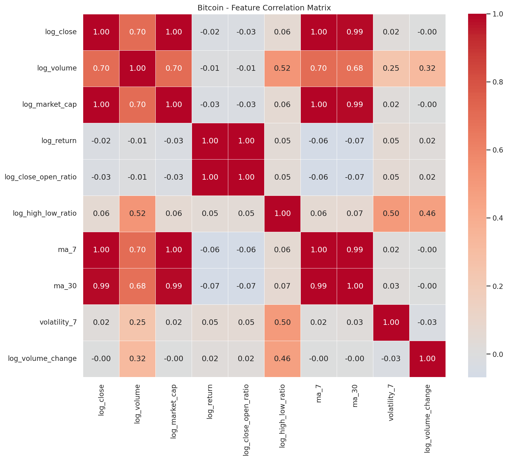
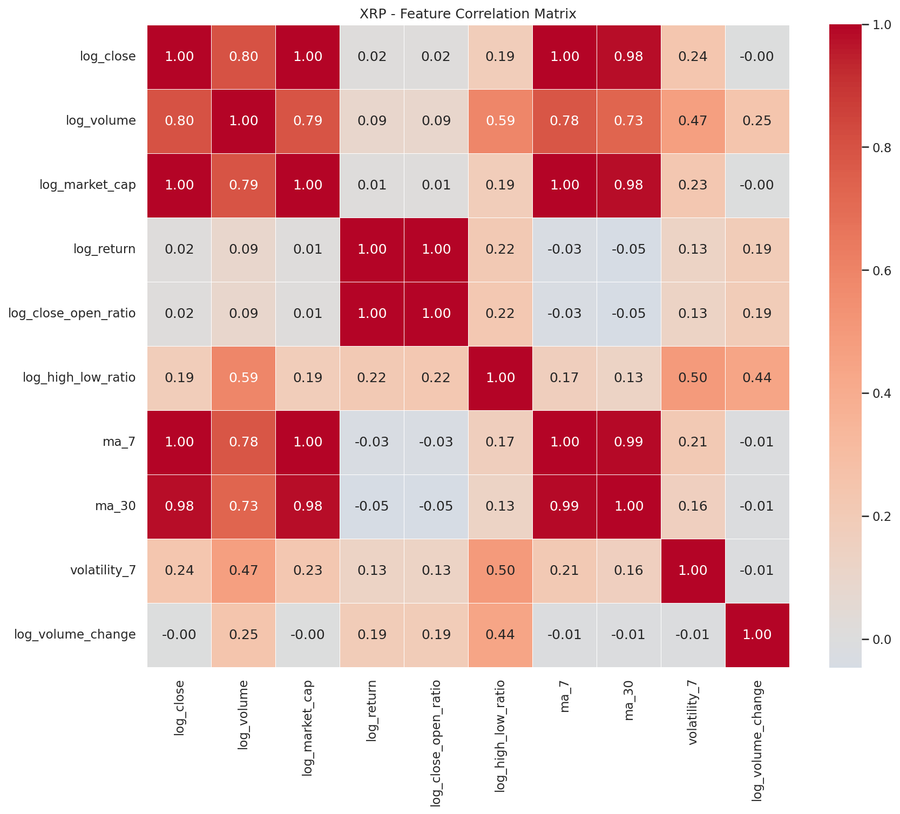
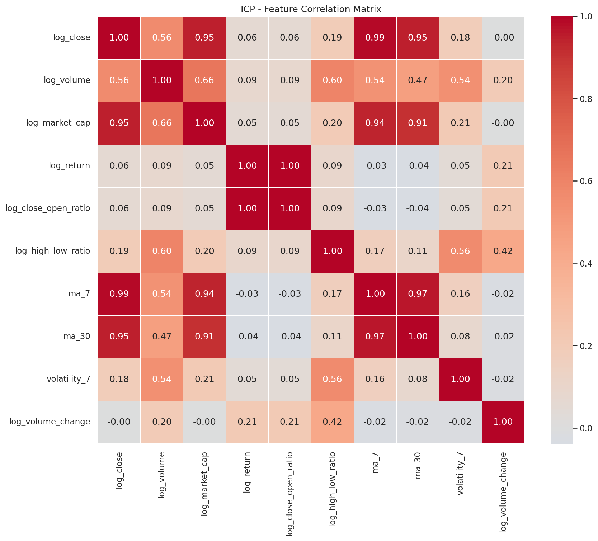

Each of Figures 6, 7, and 8 shows an 11×11 grid (10 features + 1 target variable). Each cell is colour-coded: red = strong positive correlation, blue = strong negative correlation, white = near-zero correlation. The numerical value of r is printed in each cell.

On these plots we can see two prominent patterns:

1. **The `log_close_open_ratio` / `log_return` / `price_direction` cluster** (r ≈ 0.70): As explained above, these are mathematically equivalent same-day relationships, not predictive signals.

2. **The multicollinearity cluster** among `log_close`, `ma_7`, `ma_30`, and `log_market_cap`. The Pearson correlations within this group are:

| Pair | Bitcoin (r) | XRP (r) | ICP (r) |
|---|---|---|---|
| log_close ↔ ma_7 | ≥ 0.99 | ≥ 0.98 | ≥ 0.91 |
| log_close ↔ ma_30 | ≥ 0.99 | ≥ 0.98 | ≥ 0.91 |
| log_close ↔ log_market_cap | ≥ 0.99 | ≥ 0.98 | ≥ 0.91 |
| ma_7 ↔ ma_30 | ≥ 0.99 | ≥ 0.98 | ≥ 0.91 |

This indicates severe **multicollinearity**, a situation where multiple features carry nearly identical information. Including all of them in a linear model would produce unstable and unreliable coefficient estimates. This justifies excluding these redundant features from the ML model (see Section 8).

Outside these two clusters, correlations between features and `price_direction` are near zero (|r| < 0.10), indicating that no single feature has a strong same-day predictive relationship with whether the day was bullish or bearish.

### 4.2 Lag-1 Correlation with Next-Day Price Direction

This is the core of **Research Question 2**: can we use yesterday's market data to predict whether today's price will go up or down? To test this, each feature from day (t−1) is correlated with `price_direction` at day (t).

The correlation method used is **Pearson correlation**, which is mathematically equivalent to **point-biserial correlation** when one of the two variables is binary (0/1). Only the five **stationary features** (features whose statistical properties are stable over time) are used for this analysis: `log_return`, `log_close_open_ratio`, `log_high_low_ratio`, `volatility_7`, and `log_volume_change`. The non-stationary level features (`log_close`, `ma_7`, `ma_30`, `log_market_cap`, `log_volume`) are excluded because they trend with price over time and would produce **spurious correlations**. These are apparent relationships that are an artefact of the trend rather than a true predictive signal (see Section 5.2 for the stationarity analysis).

**Results (n = 1,190 pairs after lag alignment):**

| Feature (day t−1) | Bitcoin r | p-value | XRP r | p-value | ICP r | p-value |
|---|---|---|---|---|---|---|
| `log_return` | −0.0661 | 0.0226 * | −0.0805 | 0.0055 ** | +0.0010 | 0.9728 ns |
| `log_close_open_ratio` | −0.0656 | 0.0237 * | −0.0797 | 0.0059 ** | +0.0017 | 0.9536 ns |
| `log_high_low_ratio` | +0.0166 | 0.5661 ns | +0.0060 | 0.8356 ns | +0.0101 | 0.7280 ns |
| `volatility_7` | −0.0123 | 0.6714 ns | +0.0068 | 0.8144 ns | −0.0617 | 0.0335 * |
| `log_volume_change` | +0.0075 | 0.7960 ns | −0.0070 | 0.8101 ns | +0.0541 | 0.0620 ns |

*p < 0.05 (statistically significant); **p < 0.01; ns = not statistically significant*

**Interpretation of each finding:**

- **`log_return` and `log_close_open_ratio` for Bitcoin (r = −0.066 and −0.066, p < 0.05):** A weak but statistically significant **negative** correlation. This means that when Bitcoin had a positive day (closing above its open, or a positive log return), the next day was *slightly* more likely to be bearish than bullish. This is the signature of **mean reversion**, which refers to the tendency for above-average moves to be followed by a correction. The effect is very small but real (not due to chance, given n=1,190). This directly addresses RQ2: yesterday's return does carry a small predictive signal for Bitcoin.

- **`log_return` and `log_close_open_ratio` for XRP (r = −0.081 and −0.080, p < 0.01):** The same mean-reversion pattern is stronger for XRP and more statistically significant. A strong bullish day for XRP is slightly more likely to be followed by a bearish day. This is the strongest predictive signal found in the entire analysis.

- **ICP: only `volatility_7` is marginally significant (r = −0.062, p = 0.034).** For ICP, yesterday's return carries no predictive signal. However, periods of elevated short-term volatility (`volatility_7`) are slightly more likely to be followed by bearish days. No other feature is significant for ICP.

- **All other correlations are not statistically significant (p > 0.05):** `log_high_low_ratio`, `log_volume_change`, and most ICP features show no meaningful predictive relationship.

**Key finding:** All statistically significant correlations are **weak** (|r| < 0.10). This is consistent with the **Efficient Market Hypothesis**, which states that markets rapidly incorporate publicly available information, leaving little persistent predictability in historical price patterns. Any ML model built on these features should be expected to achieve only modest accuracy above a random baseline.

**Figures 9–11 (`lag1_correlation_bitcoin.png`, `lag1_correlation_xrp.png`, `lag1_correlation_icp.png`): Lag-1 Correlation Bar Charts**

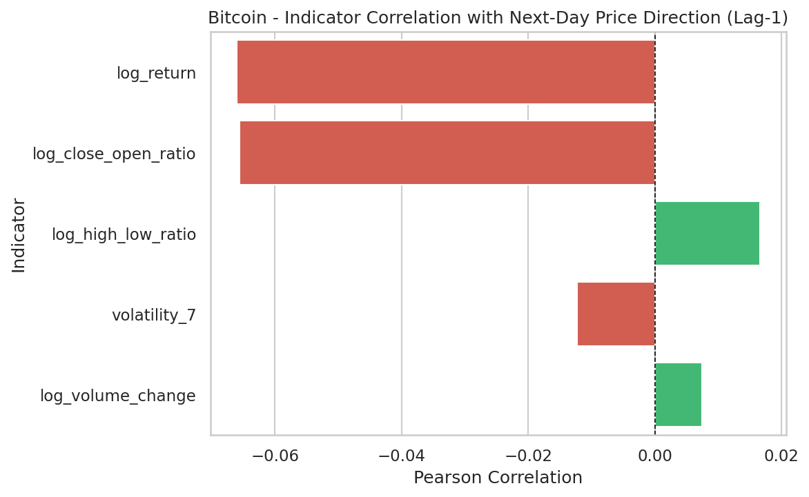
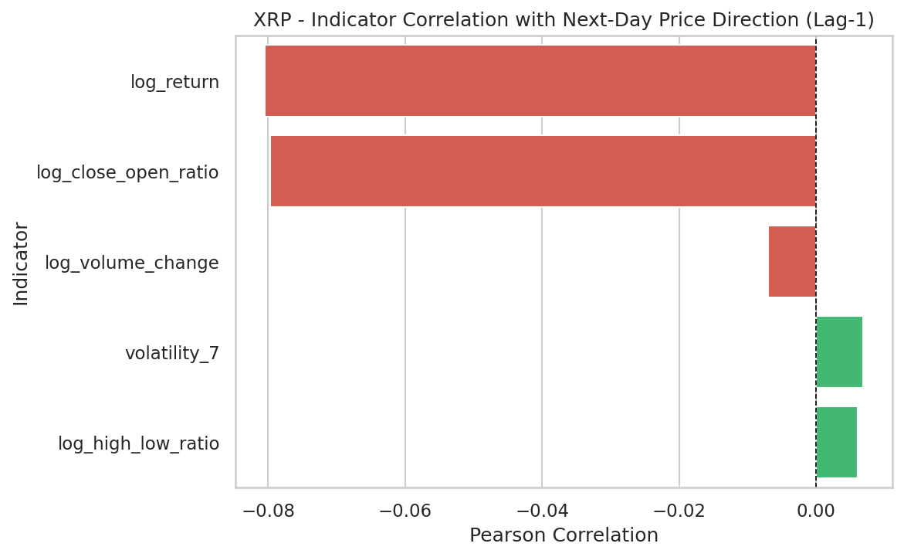
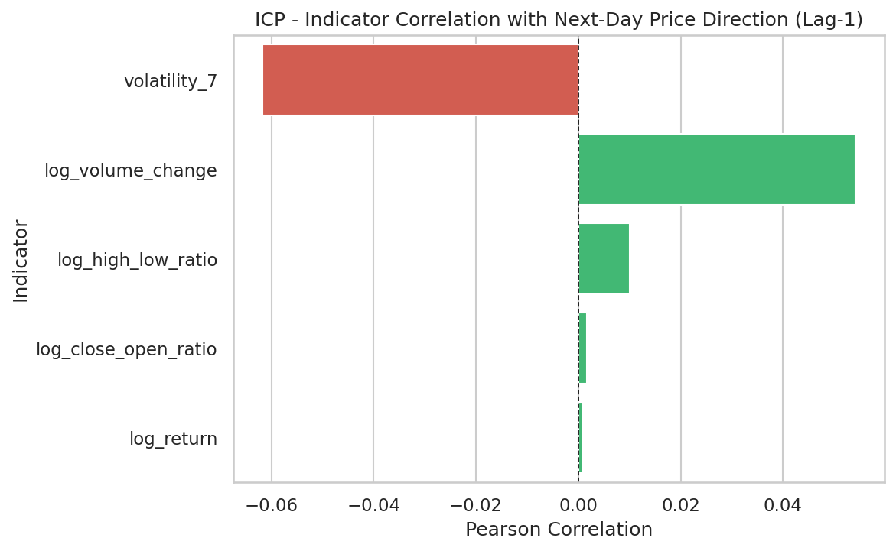

Each of Figures 9, 10, and 11 shows a horizontal bar chart with one bar per stationary feature. Green bars indicate positive correlations; red bars indicate negative correlations. The features are ranked by absolute correlation strength (strongest at the top).

On these plots we can see that for Bitcoin and XRP, the two longest bars belong to `log_return` and `log_close_open_ratio`, both pointing leftward (negative correlation). For ICP, the pattern is different. The `volatility_7` bar is the only one with meaningful length, and it also points leftward. All bars are short (all |r| < 0.10), confirming the general weakness of the predictive signal.

This indicates that the strongest available predictor for Bitcoin and XRP is whether the previous day was bullish (which slightly predicts a bearish next day), while ICP's next-day direction is more influenced by recent volatility levels than by the previous day's return direction.

### 4.3 Top Indicator Scatter Plots

**Figures 12–14 (`scatter_top_indicators_bitcoin.png`, `scatter_top_indicators_xrp.png`, `scatter_top_indicators_icp.png`): Scatter Plots with Regression Lines**

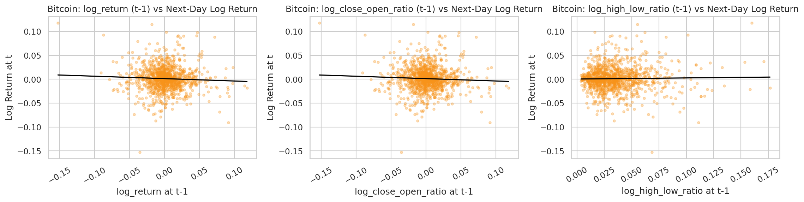
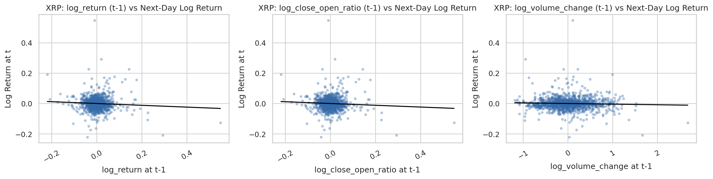
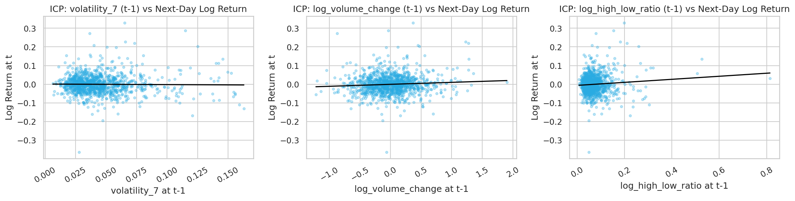

For each cryptocurrency, Figure 12–14 shows scatter plots of the three strongest lag-1 predictors (horizontal axis) against the next-day log return (vertical axis). Each dot represents one trading day. A linear regression line (black) is overlaid to visualise the direction and slope of the relationship.

On these plots we can see that all three scatter plots show **clouds of points with no clearly visible pattern**. The dots are dispersed widely around the regression line, which has a very shallow slope in all cases. The regression line for `log_return` and `log_close_open_ratio` has a slight downward slope for Bitcoin and XRP (consistent with the negative correlation), but the scatter is so large that the line explains only a tiny fraction of the variance.

This indicates that while a linear relationship exists in the data (confirmed by the p-values), the relationship is too weak to visually discern from a scatter plot and too weak to be reliably exploited by a simple linear model. Machine learning models will need to capture combinations of features rather than relying on any single indicator.

---

## 5. Time Series Analysis

### 5.1 Trends, Seasonality, and Cyclic Patterns

**Price trend:** As shown in Figure 3 (Section 3.6), Bitcoin and XRP followed an overall upward trend over the 3.3-year period, with a strong bull market phase beginning in late 2023. ICP declined overall. No regular weekly or monthly seasonality was detected in the distribution analysis, though such patterns may exist at lower statistical significance levels (day-of-week analysis was not performed within the scope of this EDA).

**Volatility cycles:** A clear pattern of alternating high-volatility and low-volatility periods is visible in Figure 18 (see Section 5.3). High volatility clusters in late 2022 (bear market) and in periods of rapid price movement; low volatility characterises the steadier bull market phases of 2023–2024.

### 5.2 Stationarity Analysis

**Stationarity** is a fundamental requirement for time-series analysis. A stationary series is one whose statistical properties, specifically mean, variance, and correlations, remain constant over time. A non-stationary series drifts: its mean shifts upward or downward as the underlying trend changes.

Using a 60-day rolling window, the mean of each feature was computed at the start and end of the study period:

| Feature | Bitcoin first 60d mean | Bitcoin last 60d mean | Drift | Verdict |
|---|---|---|---|---|
| `log_close` | 9.852 | 11.196 | +1.345 | **NON-STATIONARY** |
| `log_return` | +0.0046 | −0.0049 | −0.010 | **STATIONARY** |

| Feature | XRP first 60d mean | XRP last 60d mean | Drift | Verdict |
|---|---|---|---|---|
| `log_close` | −0.980 | +0.410 | +1.390 | **NON-STATIONARY** |
| `log_return` | −0.0001 | −0.0053 | −0.005 | **STATIONARY** |

| Feature | ICP first 60d mean | ICP last 60d mean | Drift | Verdict |
|---|---|---|---|---|
| `log_close` | +1.512 | +0.962 | −0.550 | **NON-STATIONARY** |
| `log_return` | +0.0040 | −0.0075 | −0.012 | **STATIONARY** |

`log_close` shifts by more than 1.0 log unit for Bitcoin and XRP (a massive drift), while `log_return` fluctuates around zero throughout. The same non-stationarity applies to `ma_7`, `ma_30`, `log_volume`, and `log_market_cap`, which are all derived from or correlated with `log_close`.

**Implication:** Using non-stationary features in a lag-1 correlation analysis would produce **spurious correlations**. These are apparent relationships caused by the shared trend rather than a real predictive connection. This is why the lag-1 analysis in Section 4.2 is restricted to the five stationary features in `LAG_FEATURE_COLS` only. The non-stationary features are included in the general heatmap (Figures 6–8) solely for visualising pairwise feature relationships, not for predictive inference.

### 5.3 Volatility Clustering

**Figure 18 (`rolling_volatility.png`): Rolling 30-Day Volatility Over Time**

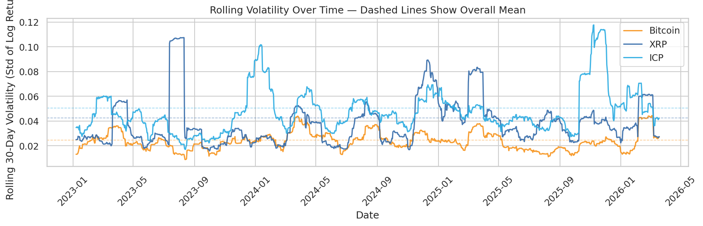

Figure 18 shows the 30-day rolling standard deviation of daily log returns for all three coins over the full study period. Rolling volatility is a measure of how turbulent the market has been over the past 30 days: a high value means returns have been spread widely (unpredictable); a low value means returns have been tight and orderly. Dashed horizontal lines mark each coin's overall average volatility.

On this plot we can see four clear patterns:

1. **A volatility spike in late 2022 / early 2023:** All three coins show elevated volatility at the start of the study period. This corresponds to the aftermath of the FTX cryptocurrency exchange collapse (November 2022), which triggered a market-wide crisis.

2. **A calm period in 2023:** After the initial shock, volatility drops below the long-run average for all three coins, corresponding to a consolidation phase.

3. **Elevated volatility in 2024:** As the bull market accelerated (partially driven by the approval of Bitcoin spot ETFs in January 2024), volatility rises again across all coins, though less dramatically than in 2022.

4. **ICP consistently sits above the other two:** ICP's rolling volatility line is almost always the highest, confirming its status as the most volatile asset in this study.

This indicates that **volatility is not constant over time** but moves in clusters. This phenomenon is known as **volatility clustering** or GARCH-like behaviour (GARCH stands for Generalised Autoregressive Conditional Heteroskedasticity, a statistical model for time-varying volatility). Practically, this means that if today is a turbulent day, tomorrow is more likely to be turbulent as well. For machine learning, this means that the `volatility_7` feature, which captures recent volatility, carries meaningful contextual information about the current market regime.

### 5.4 Autocorrelation Analysis

**Autocorrelation** measures whether today's return is predictable from yesterday's (or the day before yesterday's, etc.) return. It is computed as the Pearson correlation between the return series and a lagged version of itself. An autocorrelation at lag 1 of r = +0.10 would mean that knowing today's return helps predict tomorrow's: a positive return today slightly predicts a positive return tomorrow. An autocorrelation of r = −0.10 suggests mild mean-reversion.

The **95% confidence band** is ±1.96 / √n ≈ ±0.057 (for n = 1,197 observations). Any autocorrelation value that falls within this band is not statistically distinguishable from zero and could be due to random chance.

**Autocorrelation at key lags:**

| Coin | Lag-1 ACF | Significant? | Lag-7 ACF | Significant? |
|---|---|---|---|---|
| Bitcoin | −0.0502 | No (within band) | +0.0521 | No (within band) |
| XRP | −0.0595 | Marginal (just at boundary) | +0.0394 | No |
| ICP | +0.0528 | No (within band) | −0.0078 | No |

**Figures 15–17 (`autocorr_bitcoin.png`, `autocorr_xrp.png`, `autocorr_icp.png`): Autocorrelation Bar Charts**

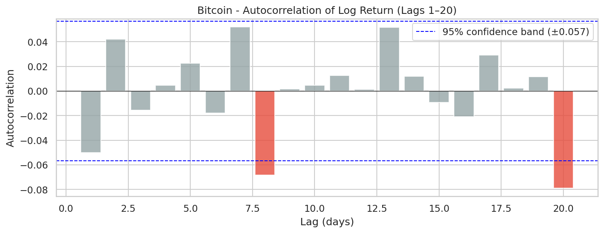
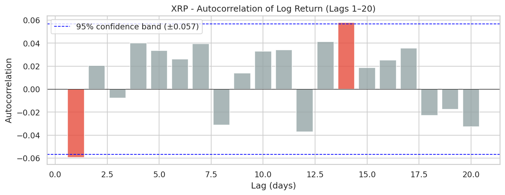
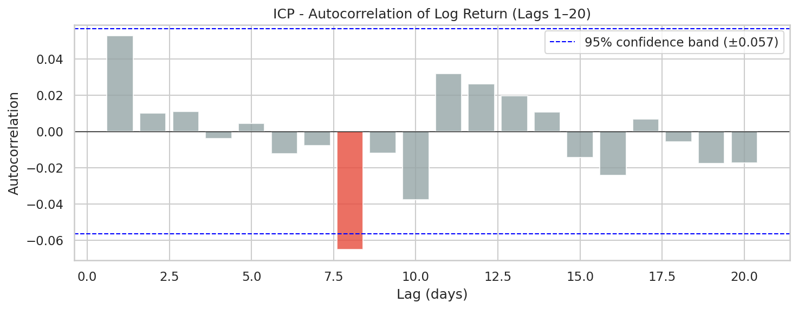

Each of Figures 15, 16, and 17 shows 20 vertical bars, one per lag day from 1 to 20. The height of each bar is the autocorrelation at that lag. Dashed blue horizontal lines mark the 95% confidence band (±0.057). Red bars indicate lags where the autocorrelation falls outside the confidence band (statistically significant); grey bars are within the band (not significant).

On these plots we can see that **the vast majority of bars are grey and within the confidence band for all three coins**, meaning returns at most time lags are not significantly correlated with each other. Bitcoin shows a slightly negative lag-1 bar that is close to (but within) the confidence band. XRP's lag-1 bar reaches just to the boundary. ICP shows a slight positive lag-1 and no consistent pattern at other lags.

This indicates that **cryptocurrency log returns are close to a random walk**. Past returns carry very little information about future returns. The market is near-efficient for all three assets. This is a critical finding for RQ2: it sets a realistic upper bound on prediction accuracy. Any model based only on these historical market indicators should not be expected to achieve accuracy much above 55–58%.

**Can indicator X from day t−1 predict price direction on day t?**

- **`log_return` (Bitcoin, t−1):** Yes, weakly. r = −0.066 (p = 0.023). A bullish previous day very slightly predicts a bearish next day. The signal is real but small.
- **`log_return` (XRP, t−1):** Yes, weakly. r = −0.081 (p = 0.006). Slightly stronger mean-reversion than Bitcoin.
- **`log_return` (ICP, t−1):** No. r = +0.001 (p = 0.973). Yesterday's return does not predict today's direction for ICP.
- **`log_close_open_ratio` (Bitcoin and XRP, t−1):** Yes, weakly (same pattern and significance as log_return).
- **`volatility_7` (ICP, t−1):** Marginally. r = −0.062 (p = 0.034). Elevated recent volatility slightly predicts a bearish next day for ICP.
- **All other features:** No statistically significant predictive relationship found.

---

## 6. Cross-Asset Analysis

### 6.1 Are the Assets Correlated with Each Other?

**Figure 19 (`cross_asset_correlation.png`): Cross-Asset Log Return Correlation Heatmap**

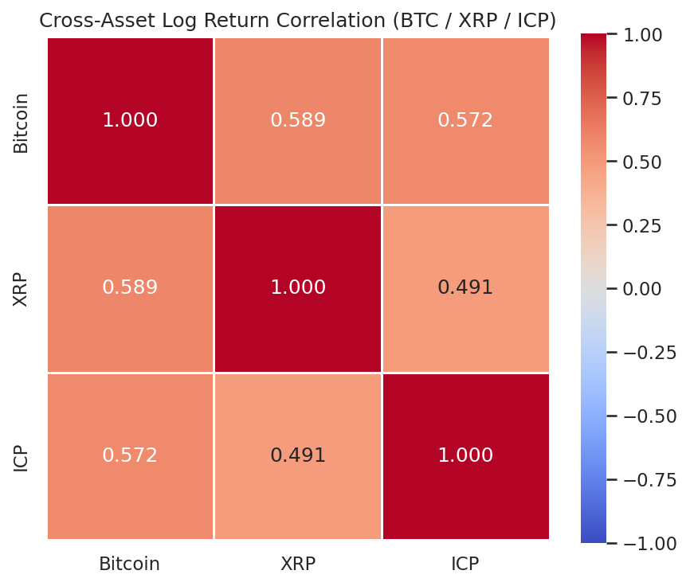

Figure 19 shows a 3×3 correlation matrix where each cell displays the Pearson correlation between the daily log returns of two different cryptocurrencies. The colour scale runs from blue (negative correlation) to red (positive correlation), with exact values annotated in each cell.

On this plot we can see that all three pairwise correlations are **positive and moderate:**

| Pair | Pearson r |
|---|---|
| Bitcoin ↔ XRP | 0.589 |
| Bitcoin ↔ ICP | 0.572 |
| XRP ↔ ICP | 0.491 |

This indicates that the three assets move in the same direction on most days. If Bitcoin has a positive day, XRP and ICP are more likely (but not certain) to also have a positive day. However, the correlations are well below 1.0, meaning substantial coin-specific variation exists.

### 6.2 Interpretation: What Drives Co-Movement?

The moderate positive correlations reflect the well-documented **Bitcoin dominance** effect in cryptocurrency markets. Bitcoin is the reference asset: news affecting the overall crypto market (regulatory announcements, macroeconomic events, institutional adoption) tends to move all coins simultaneously. XRP shows slightly higher correlation with Bitcoin (0.589) than ICP does (0.572), suggesting that ICP has somewhat more coin-specific dynamics (perhaps related to its unique technology platform and use case).

A correlation of ~0.58 means that approximately **58% of Bitcoin's directional information** (linear component) is shared with XRP. The remaining 42% is unique to XRP. This leaves meaningful room for coin-specific predictors.

### 6.3 Do the Assets React Similarly to Market Events?

Yes, broadly. As visible in Figure 3 (price trend) and Figure 18 (rolling volatility), all three coins show:
- A shared volatility spike in late 2022 (FTX collapse)
- A shared recovery and bull-market phase in 2023–2024
- A general correlation in direction of return

However, the magnitude of reactions differs substantially: ICP's cumulative return over the period is −42% while Bitcoin's is +306%. The same macro environment produced dramatically different outcomes.

### 6.4 Implications for ML Generalisation

The moderate cross-asset correlation has two important implications for machine learning:

1. **Train separate models per coin.** Since each coin retains substantial coin-specific variance (not explained by co-movement), a single model trained on pooled data across all three coins would dilute coin-specific signals. Three separate models are recommended, one per asset.

2. **Features from one coin may not generalise to another.** The lag-1 correlations differ across coins (mean-reversion is significant for BTC and XRP but not ICP). A feature set optimised for Bitcoin may perform poorly on ICP.

---

## 7. Key Findings Summary

### RQ1: Which market indicators have the strongest relationship with cryptocurrency price changes?

**Finding 1 (answers RQ1):** Among stationary predictors measured at day (t−1), `log_return` and `log_close_open_ratio` show the strongest relationship with next-day price direction for Bitcoin and XRP, with r = −0.066 and −0.080 respectively (both p < 0.05). This shows that these two indicators carry the most predictive information for Bitcoin and XRP, albeit weakly. For ICP, `volatility_7` shows the strongest (marginal) relationship (r = −0.062, p = 0.034).

**Finding 2 (answers RQ1):** The non-stationary level features (`log_close`, `ma_7`, `ma_30`, `log_market_cap`) show near-zero correlations with next-day price direction (|r| < 0.05, all p > 0.10 after correcting for non-stationarity). Despite their apparent visual association with price trends, they carry no meaningful short-term predictive signal for day-ahead direction.

**Finding 3 (answers RQ1):** The features `log_close`, `ma_7`, `ma_30`, and `log_market_cap` form a near-perfectly correlated cluster (pairwise r ≥ 0.91 across all coins), constituting severe multicollinearity. Including all of them in a linear model would produce unstable and redundant coefficients.

### RQ2: How accurately can t−1 indicators predict next-day price direction?

**Finding 4 (answers RQ2):** The autocorrelation analysis (Figures 15–17) shows that for all three coins, log returns at lags 1–20 are almost entirely within the 95% confidence band (±0.057), indicating that daily returns are close to a random walk. The ACF values at lag 1 are: Bitcoin −0.050, XRP −0.060, ICP +0.053. None of these values are clearly outside the confidence band.

**Finding 5 (answers RQ2):** The lag-1 correlation analysis (Figures 9–11) shows that the best single predictor (yesterday's `log_return`) achieves r = −0.081 for XRP, explaining less than 0.7% of the variance in next-day direction (r² = 0.0065). Based on this evidence, realistic model accuracy should be expected in the range of **52–58%**, only marginally above the 50% baseline of a coin-flip.

**Finding 6 (answers RQ2):** The predictability differs across assets: Bitcoin and XRP show statistically significant mean-reversion signals (p < 0.05), while ICP shows no statistically significant lag-1 return predictability (p > 0.97). ICP is the hardest of the three assets to predict.

### Cross-asset finding (relevant to RQ3):

**Finding 7:** All three assets show moderate positive pairwise correlation of daily log returns (r = 0.49–0.59). This confirms a shared market-wide signal but also substantial coin-specific dynamics, supporting the decision to train separate models per asset.

---

## 8. Transition to ML Modelling

### 8.1 Target Variable Definition

The target variable for all ML models is defined precisely as:

> **`price_direction` at day t**: a binary variable equal to 1 if the closing price exceeds the opening price on day t (price rose during the day), and 0 otherwise (price fell or was flat). The model is trained using features computed from day (t−1) only. No information from day t is used as input, ensuring that the model simulates a real-world prediction scenario.

### 8.2 Feature Selection

**Recommended feature set (based on EDA findings):**

The following five features from day (t−1) constitute the recommended input for the first ML model:

| Feature | Justification |
|---|---|
| `log_return` | Strongest or second-strongest lag-1 predictor for Bitcoin (r=−0.066, p=0.023) and XRP (r=−0.081, p=0.006). Captures the mean-reversion signal. |
| `log_close_open_ratio` | Equivalent predictive power to `log_return` (r≈−0.066 for BTC, r≈−0.080 for XRP, both significant). Measures intraday momentum from the previous day. |
| `log_high_low_ratio` | Not individually significant (|r| < 0.02 for BTC and XRP), but included as a proxy for intraday uncertainty. It may carry information through non-linear interactions with other features. |
| `volatility_7` | Significant for ICP (r=−0.062, p=0.034); provides market-regime context for all coins. |
| `log_volume_change` | Not individually significant, but captures trading activity changes that may carry information in combination with other features. |

**Features to exclude:**

| Feature | Reason for exclusion |
|---|---|
| `log_close` | Non-stationary. Trends with price level → spurious correlations. |
| `ma_7` | Non-stationary. Collinear with `log_close` (r ≥ 0.91). Carries no independent information. |
| `ma_30` | Non-stationary. Collinear with `log_close` (r ≥ 0.91). Carries no independent information. |
| `log_market_cap` | Non-stationary. Collinear with `log_close` (r ≥ 0.91). Market cap is nearly a scaled version of price. |
| `log_volume` | Non-stationary. Replaced by the stationary `log_volume_change`. |
| `log_close_open_ratio` (same-day) | Would constitute data leakage. This feature is essentially the target variable computed on the same day. |

### 8.3 Which Cryptocurrencies Are Most Suitable for Modelling?

**Bitcoin and XRP** are the most suitable assets for ML modelling because:
- Both show statistically significant lag-1 predictive signals (p < 0.05 for `log_return` and `log_close_open_ratio`)
- Their return distributions, while non-normal, are more regular. Bitcoin has a kurtosis of 3.49, which is much lower than XRP's overall return kurtosis of 28.74. However, XRP's outliers are rare events that may not recur reliably.
- Their price direction classes are nearly perfectly balanced (50/49%)

**ICP** is the most challenging asset because:
- No statistically significant return-based lag-1 predictor was found (p > 0.97 for `log_return`)
- It has the highest volatility (mean 4.41% daily) and the widest tails (kurtosis 6.54)
- Its price direction is slightly more imbalanced (47/53%)
- Its cumulative performance is negative, suggesting the asset faced idiosyncratic headwinds not captured by technical indicators

Despite these challenges, ICP will be included in the modelling phase, as a comparison across all three assets is valuable for testing generalisation.

### 8.4 Data Characteristics That Constrain Model Choice

Three findings from the EDA directly determine which models are appropriate:

1. **Near-random signal (Finding 4).** Log returns for all three coins fall within or near the 95% confidence band (±0.057) at every autocorrelation lag. The strongest predictive signal explains less than 0.7% of variance (r² = 0.0065 for XRP log_return). This favours simple, low-variance models over complex ones that require rich structure to generalise.

2. **Small dataset.** After lag alignment and dropping rolling-window NaNs, approximately 1,190 observations are available. Complex models with many hyperparameters require more data and more cross-validation folds to tune reliably.

3. **Linear predictive signal (Finding 1).** The statistically significant predictors, namely `log_return` and `log_close_open_ratio` for Bitcoin and XRP, show a linear mean-reversion pattern. The EDA found no evidence of non-linear interactions or multi-lag structure that would reward a non-linear ensemble model.

These three characteristics together define a clear principle: **model complexity must be proportional to the evidence of complexity in the data.**

### 8.5 Model Evaluation

Four candidate models are assessed below. Each is evaluated against the three data characteristics above.

---

**Model 1: Logistic Regression (recommended)**

Logistic Regression is a linear model designed for binary classification. It estimates the probability that a given day will be bullish based on a weighted combination of the input features. The weights (coefficients) directly show how much each feature contributes to the prediction.

*Why the EDA supports it:* Finding 1 confirmed statistically significant linear predictors for Bitcoin (r = −0.066, p = 0.023) and XRP (r = −0.081, p = 0.006). Logistic Regression is built to capture exactly this kind of weak linear signal. Its coefficients also answer RQ1 directly by quantifying feature importance.

| Pros | Cons |
|---|---|
| Directly interpretable: coefficients show the direction and magnitude of each feature's contribution | Assumes a linear decision boundary and cannot capture non-linear relationships |
| Statistically principled: outputs class probabilities, not just binary labels | Accuracy ceiling is low, given the weakness of the linear signal |
| Robust with small datasets (~1,190 observations, 5 features) | Sensitive to multicollinearity, though this is already addressed by the feature selection in Section 8.2 |
| No hyperparameter tuning required | |
| Directly consistent with EDA findings | |

---

**Model 2: Decision Tree (recommended)**

A Decision Tree splits the data at each node using the feature and threshold that best separates bullish from bearish days. A depth-limited tree (max_depth 3 to 5) captures the most important splits without memorising noise.

*Why the EDA supports it:* The EDA found no strong linear signal for ICP (p > 0.97 for log_return), suggesting that if any structure exists for that coin, it may be non-linear. A shallow Decision Tree can capture simple threshold effects and interactions that Logistic Regression cannot, without requiring the large dataset that a full ensemble needs. It also handles multicollinearity natively by selecting one feature per split.

| Pros | Cons |
|---|---|
| Fully interpretable: every decision path can be drawn and explained | High variance: a single tree is prone to overfitting, particularly with a weak signal |
| Handles multicollinearity natively by selecting one feature per split | Accuracy typically lower than ensemble methods |
| Captures simple non-linear threshold effects | Sensitive to small changes in training data |
| Appropriate complexity for the dataset size | Max depth must be tuned to avoid memorising noise |
| Consistent with the project feasibility study scope | |

---

**Model 3: Random Forest (acceptable for comparison)**

A Random Forest trains many Decision Trees on random subsets of the data and features, then takes a majority vote. Individual trees overfit in different directions, so their errors partially cancel out. This is known as bagging.

*Why the EDA partially supports it:* Random Forest reduces the high variance of a single Decision Tree without introducing the heavy hyperparameter burden of gradient boosting. It is a reasonable step up and provides built-in feature importance scores as an alternative measure of indicator relevance for RQ1.

*Why the EDA limits it:* With ~1,190 observations and a near-random signal, the variance reduction benefit of bagging is smaller than on larger datasets. The model is no longer directly interpretable, which weakens the connection to RQ1 and RQ3.

| Pros | Cons |
|---|---|
| Reduces variance compared to a single Decision Tree through bagging | Not directly interpretable: individual trees cannot be read as a decision path |
| Robust out of the box with minimal tuning | With only ~1,190 observations, the gain over a single Decision Tree may be small |
| Built-in feature importance scores support RQ1 | Requires time-series cross-validation to avoid data leakage |
| Handles multicollinearity and class imbalance well | |

---

**Model 4: XGBoost (not recommended for this dataset)**

XGBoost (Extreme Gradient Boosting) trains trees sequentially, where each new tree corrects the errors of the previous one. It is widely regarded as the best-performing model for structured tabular data in general.

*Why the EDA does not support it here:* XGBoost is powerful because it finds complex, non-linear, multi-way interactions in data. The EDA found no evidence of such structure. The ACF analysis (Figures 15–17) showed that log returns are close to a random walk. The lag-1 correlation analysis (Figures 9–11) found only weak linear signals. XGBoost applied to near-random data does not find real patterns. It finds noise and memorises it. Additionally, XGBoost requires tuning of many hyperparameters (learning rate, max_depth, n_estimators, subsample, column subsampling, L1 and L2 regularisation). With ~1,190 observations and time-series cross-validation, each training fold has very few samples, making reliable tuning difficult.

| Pros | Cons |
|---|---|
| State of the art for tabular data in general | The EDA found no complex non-linear structure for XGBoost to exploit |
| Often outperforms simpler models when patterns are rich | Requires tuning of many hyperparameters, difficult with ~1,190 observations |
| Built-in regularisation can mitigate overfitting to some degree | Low interpretability without additional tools such as SHAP values |
| Demonstrates familiarity with modern ML tooling | Any result above 60% accuracy should be treated as a sign of overfitting rather than genuine predictive power |

---

### 8.6 Model Comparison Summary

| Model | EDA justification | Complexity fit | Interpretability | Recommendation |
|---|---|---|---|---|
| Logistic Regression | Strong: linear signal confirmed for BTC and XRP | Low | High | Recommended |
| Decision Tree | Moderate: handles weak non-linear splits | Low | High | Recommended |
| Random Forest | Partial: reduces variance, but limited by dataset size | Medium | Medium | Optional comparison |
| XGBoost | Weak: no complex structure found in EDA | High | Low | Not recommended |

The two recommended models are Logistic Regression and Decision Tree. Both are directly justified by the EDA findings, appropriate for the dataset size, and interpretable enough to support answers to all three research questions.

### 8.8 Evaluation Strategy

- **Primary metric:** Accuracy (fraction of correctly predicted days). Appropriate because classes are balanced (~50/50 for all coins).
- **Secondary metric:** Confusion matrix, to check whether errors are systematically biased toward false positives or false negatives.
- **Benchmark:** A naive baseline predicting the majority class (e.g. always predicting "bearish" for ICP) achieves 52.6% accuracy. Any model must exceed this threshold to demonstrate that it has learned something.
- **Realistic accuracy range:** Based on the ACF and lag-1 correlation analysis, expect accuracy in the range of **52–58%** for Bitcoin and XRP. Results significantly above 60% should be treated with suspicion and examined for data leakage.
- **Separate models per coin:** Given the differing predictability profiles (Finding 5 and Finding 6), three separate sets of models (one per coin × two model types = 6 models total) will be trained and compared. If Random Forest is included as an optional third model, this extends to 9 models total.

### 8.9 Proposed Feature Set for the First Model

```
Feature set for Model 1 (Logistic Regression):
  X = [log_return(t-1), log_close_open_ratio(t-1), log_high_low_ratio(t-1),
       volatility_7(t-1), log_volume_change(t-1)]
  y = price_direction(t)
  n ≈ 1,190 observations (after dropping rolling-window NaNs and lag alignment)
```

All features are already in log-transformed, dimensionless form. No further scaling is strictly required, though standardisation (zero mean, unit variance) is recommended before Logistic Regression to ensure the solver converges efficiently and coefficients are comparable in magnitude.

---

*All plots referenced in this report are saved in the `images/` directory of the project repository. Statistical analyses were performed using Python (pandas 3.0.1, NumPy, SciPy) on the processed feature files in `data/data_processed/`.*

*Source code: `src/coinmarket_eda.py`*
